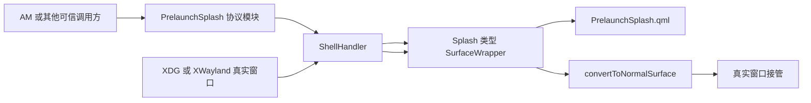

# Treeland 预启动闪屏详细设计说明（AI 评审版）

## 1. 文档目的
本文档用于还原一份更适合 AI 代码评审、设计审查与缺陷定位的工程化说明。与管理视角版本不同，这份文档优先描述源码结构、对象关系、状态转换、潜在缺陷和当前分支快照中的不一致点，方便不同 AI 在同一上下文下进行交叉审阅。

本文档结论仅基于 Treeland 当前仓内可见源码，不扩展到外部项目实现。对于 AM（dde-application-manager），这里只把它视为可信的启动调用方和联调对象，不把它作为 Treeland 仓内实现的一部分。

## 2. 评审目标
本功能的目标是在应用真实窗口尚未到达前，以协议驱动的占位界面提供立即反馈，并在真实窗口出现后完成匹配和替换。AI 评审时应重点关注四个问题：其一，协议对象生命周期是否完整；其二，闪屏包装体到真实窗口包装体的转换是否存在状态漏洞；其三，超时、主动关闭、异常断连等回收路径是否真正闭环；其四，当前分支中的头文件与实现文件是否仍处于未收敛状态。

## 3. 源码快照与边界
本设计涉及的核心文件如下：

- `src/modules/prelaunch-splash/prelaunchsplash.h`
- `src/modules/prelaunch-splash/prelaunchsplash.cpp`
- `src/core/shellhandler.h`
- `src/core/shellhandler.cpp`
- `src/surface/surfacewrapper.h`
- `src/surface/surfacewrapper.cpp`
- `src/core/qml/PrelaunchSplash.qml`
- `src/core/windowconfigstore.h`
- `src/core/windowconfigstore.cpp`
- `misc/dconfig/org.deepin.dde.treeland.json`
- `misc/dconfig/org.deepin.dde.treeland.app.json`

当前分支已经可以看出完整设计意图，但实现快照仍存在接口命名和成员收敛不完全的问题，因此评审时不能简单把头文件声明视为最终真相，而应同时比对实现文件的实际行为。

## 4. 系统结构总览
预启动闪屏链路可以概括为“协议接入 -> ShellHandler 编排 -> Splash SurfaceWrapper 占位 -> 真实窗口匹配接管 -> 占位界面销毁”。其中协议层负责把 Wayland 请求转换为 Treeland 内部信号，ShellHandler 负责策略决策和对象编排，SurfaceWrapper 承担从 SplashScreen 到 Normal Surface 的状态过渡，QML 只负责界面呈现和销毁信号回传。



## 5. 协议层设计

### 5.1 对外能力
协议模块由 `PrelaunchSplash` 暴露，继承 `QObject` 与 `WServerInterface`。从 `prelaunchsplash.h` 可见，对外信号有两个：`splashRequested(appId, instanceId, qw_buffer*)` 和 `splashCloseRequested(appId, instanceId)`。这说明设计上，协议层不仅负责发起创建，还负责把关闭请求或客户端断连统一回传到编排层。

### 5.2 服务端创建流程
在 `prelaunchsplash.cpp` 中，`PrelaunchSplashPrivate::treeland_prelaunch_splash_manager_v2_create_splash(...)` 会接收 `app_id`、`instance_id`、`sandboxEngineName` 与 `icon_buffer`，随后创建 `SplashResource`。如果 `wl_resource_create` 失败，则直接 `wl_resource_post_no_memory` 并返回。若创建成功，则通过 `QW_NAMESPACE::qw_buffer::try_from_resource` 把图标缓冲包装为 `qw_buffer*`，再发出 `splashRequested(app_id, instance_id, qb)`。

这意味着协议层本身并不做策略判断，也不持有 UI 对象，它只负责把 Wayland 资源事件转交给上层。

### 5.3 协议对象销毁语义
`SplashResource` 的 `treeland_prelaunch_splash_v2_destroy_resource(...)` 中会统一发出 `splashCloseRequested(m_appId, m_instanceId)`，并删除自身。代码注释明确写了这条路径同时覆盖显式 `destroy()` 与客户端 crash/disconnect。也就是说，设计意图是把“主动关闭”和“异常断连”折叠为同一个上层回收入口。

对 AI 评审而言，这里最重要的问题不是协议层本身，而是上层是否真的实现并接通了对应关闭处理逻辑。

## 6. ShellHandler 设计意图与实现现状

### 6.1 设计意图
从 `shellhandler.h` 可以看出，ShellHandler 原计划承担以下职责：

1. 接收 `handlePrelaunchSplashRequested(appId, instanceId, iconBuffer)`。
2. 接收 `handlePrelaunchSplashClosed(appId, instanceId)`。
3. 通过 `createPrelaunchSplash(...)` 创建带尺寸和主题配置的占位窗口。
4. 在真实窗口到达时，通过 `ensureXdgWrapper(...)` / `ensureXwaylandWrapper(...)` 或同义接口完成匹配复用。
5. 维护三类关键状态：`m_prelaunchWrappers`、`m_pendingPrelaunchAppIds`、`m_closedSplashAppIds`。
6. 使用 `WindowConfigStore` 拉取上次窗口尺寸和闪屏主题配置。

这是一套相对完整的架构设计，支持请求去重、异步配置、关闭传播和回收控制。

### 6.2 当前实现快照
当前 `shellhandler.cpp` 中实际可见的是另一套尚未完全收敛的实现：

1. 文件仍然包含 `core/windowsizestore.h`，并在构造函数中初始化 `m_windowSizeStore`。
2. `handlePrelaunchSplashRequested(...)` 的实现只接收 `appId` 和 `iconBuffer`，没有 `instanceId` 参数。
3. 实现中直接用 `WindowSizeStore::lastSizeFor(appId)` 获取初始尺寸，没有接入 `WindowConfigStore::withSplashConfigFor(...)` 的异步配置路径。
4. 头文件声明的是 `ensureXdgWrapper(...)` / `ensureXwaylandWrapper(...)`，实现中实际出现的是 `matchOrCreateXdgWrapper(...)` / `matchOrCreateXwaylandWrapper(...)`。
5. 头文件声明了 `handlePrelaunchSplashClosed(...)` 和 `createPrelaunchSplash(...)`，但在当前实现快照中未看到对应完整实现。

这说明当前分支很可能处于“从旧版 WindowSizeStore 方案向 WindowConfigStore 方案迁移”的中间态。对 AI 评审来说，这一事实必须明确记录，否则容易得出错误结论，例如误判某些设计已经落地，或者忽略关闭路径尚未完全收口的问题。

### 6.3 当前创建逻辑
`shellhandler.cpp` 中现有 `handlePrelaunchSplashRequested(...)` 的逻辑如下：

```cpp
void ShellHandler::handlePrelaunchSplashRequested(const QString &appId,
                                                  QW_NAMESPACE::qw_buffer *iconBuffer)
{
    if (!Helper::instance()->globalConfig()->enablePrelaunchSplash())
        return;
    if (!m_appIdResolverManager)
        return;
    if (appId.isEmpty())
        return;
    if (std::any_of(m_prelaunchWrappers.cbegin(),
                    m_prelaunchWrappers.cend(),
                    [&appId](SurfaceWrapper *w) { return w && w->appId() == appId; })) {
        return;
    }
    ...
}
```

这段代码体现了三个当前已生效的约束：全局开关必须开启、AppIdResolverManager 必须存在、相同 `appId` 的 splash 不允许重复创建。随后实现会读取上次窗口尺寸，创建一个未绑定真实 `shellSurface` 的 `SurfaceWrapper`，加入 `m_workspace` 和 `m_prelaunchWrappers`，再用单次计时器执行超时销毁。

### 6.4 超时回收逻辑
当前实现里，超时值来自全局配置 `prelaunchSplashTimeoutMs`，并额外做了两层约束：小于等于 0 时不自动销毁，大于 60000 会被钳制到 60000。超时后通过 `QPointer` 守卫检查 `ShellHandler` 和 `SurfaceWrapper` 是否仍有效，再从 `m_prelaunchWrappers` 删除对应项，并调用 `m_rootSurfaceContainer->destroyForSurface(wrapper)`。

这条路径本身是合理的，但 AI 在评审时需要继续追问两个问题：第一，主动关闭与异常断连是否也会走到同样的删除逻辑；第二，如果真实窗口已经匹配成功并完成转换，定时器回调是否一定会因为 wrapper 已被移出列表而安全退出。

## 7. 真实窗口匹配与转换

### 7.1 XDG 路径
当 `WXdgToplevelSurface` 到达时，`onXdgToplevelSurfaceAdded(...)` 会优先尝试通过 `m_appIdResolverManager->resolvePidfd(...)` 异步解析 appId。如果解析请求成功，后续在回调中调用 `matchOrCreateXdgWrapper(raw, appId)`，并执行 `initXdgWrapperCommon(...)`。若异步解析未启动或失败，则直接调用 `matchOrCreateXdgWrapper(surface, QString())` 走降级路径。

`matchOrCreateXdgWrapper(...)` 的核心逻辑是：若拿到了非空 `targetAppId`，就在 `m_prelaunchWrappers` 中寻找 `candidate->appId() == targetAppId` 的 splash wrapper；命中后从列表中移除，调用 `wrapper->convertToNormalSurface(surface, SurfaceWrapper::Type::XdgToplevel)`；若未命中则新建普通窗口 wrapper。

### 7.2 XWayland 路径
XWayland 路径与 XDG 基本对称，区别在于它从 `notify_associate` 时机发起匹配。当 pidfd 可用且 resolver 存在时，会先异步解析 appId，再调用 `matchOrCreateXwaylandWrapper(raw, appId)`；否则直接按普通窗口创建。其匹配策略仍然是基于 `targetAppId` 在 `m_prelaunchWrappers` 中查找并转换。

### 7.3 当前匹配粒度的限制
尽管协议层设计已经把 `instanceId` 作为一等参数传进来，但当前 `shellhandler.cpp` 的匹配实现只基于 `appId`。这带来一个非常明确的审查点：如果同一 `appId` 的多个实例被并发启动，当前分支的匹配粒度是否足够，或者是否会出现“先来的真实窗口接管了后来的 splash”这类错配问题。

如果 AI 评审希望判断该功能是否可安全规模化，这一条应被列为高优先级问题。

## 8. SurfaceWrapper 状态机

### 8.1 Splash 构造状态
`surfacewrapper.cpp` 中专门存在一套用于预启动闪屏的构造函数，其特征是：

1. `m_shellSurface` 初始为 `nullptr`。
2. `m_type` 被设置为 `Type::SplashScreen`。
3. `m_appId` 在构造时直接写入。
4. 若存在历史尺寸则设置 implicit size，否则默认使用 `800x600`。
5. 立即通过 `m_engine->createPrelaunchSplash(...)` 创建 QML 占位界面。
6. `updateHasActiveCapability(ActiveControlState::MappedOrSplash, true)` 使 splash 也被视作可见占位态。

这意味着 splash wrapper 并不是“真实窗口的皮肤”，而是一个先于真实 `shellSurface` 独立存在的窗口包装体。

### 8.2 转换入口
`convertToNormalSurface(...)` 是整个状态机的关键枢纽：

```cpp
void SurfaceWrapper::convertToNormalSurface(WToplevelSurface *shellSurface, Type type)
{
    if (m_type != Type::SplashScreen || m_shellSurface != nullptr) {
        qCCritical(treelandSurface)
            << "convertToNormalSurface can only be called on prelaunch surfaces";
        return;
    }

    m_shellSurface = shellSurface;
    m_type = type;
    Q_EMIT typeChanged();
    setup();
    ...
}
```

这段实现说明转换被限定为一次性动作：只有 `Type::SplashScreen` 且尚未绑定 `m_shellSurface` 的 wrapper 才允许被接管。对 AI 来说，这个函数是检查状态正确性的第一落点。

### 8.3 映射前后差异
转换后如果真实 `surface()->mapped()` 已经为真，代码会立刻补发 `m_prelaunchOutputs`、更新 active state，并通过 `QMetaObject::invokeMethod(m_prelaunchSplash, "hideAndDestroy", Qt::QueuedConnection)` 隐藏 splash。若此时真实窗口尚未 mapped，则会延迟到后续映射事件再执行剩余处理。

这意味着实现试图避免在 wl_surface 尚未完全准备好时过早下发输出和激活相关操作，但同时也引入新的审查点：延迟路径是否会遗漏 splash 销毁、重复连接是否会造成多次回调、映射失败是否会留下半转换状态对象。

### 8.4 QML 销毁回调
`PrelaunchSplash.qml` 提供 `hideAndDestroy()`，其行为非常直接：如果已经不可见则打印告警并返回，否则把 `visible` 置为 `false` 并发出 `destroyRequested()`。C++ 层在构造 splash wrapper 时已把这个信号连接到 `onPrelaunchSplashDestroyRequested()`。因此 splash 可视层并不是立即自毁，而是通过 QML -> C++ 的回调通知完成对象侧清理。

## 9. 配置模型

### 9.1 全局配置
`misc/dconfig/org.deepin.dde.treeland.json` 当前至少包含两个直接相关的全局项：

1. `enablePrelaunchSplash`
2. `prelaunchSplashTimeoutMs`

前者决定功能总开关，后者决定自动回收超时。当前 `shellhandler.cpp` 的已落地逻辑实际上只直接消费了这两个全局项。

### 9.2 应用级配置
`misc/dconfig/org.deepin.dde.treeland.app.json` 已定义如下应用级字段：

1. `enablePrelaunchSplash`
2. `lastWindowWidth`
3. `lastWindowHeight`
4. `splashThemeType`
5. `splashDarkPalette`
6. `splashLightPalette`

对应的 `WindowConfigStore` 已经提供 `saveLastSize(...)` 和 `withSplashConfigFor(...)`。从 `withSplashConfigFor(...)` 实现可见，它已经支持三种状态：初始化成功立即回调、初始化失败直接跳过、初始化中则挂接单次回调等待完成。

因此从设计成熟度上看，应用级主题与尺寸配置的抽象已经存在，但当前 ShellHandler 实现尚未全部切换到这套新接口。

## 10. 当前分支的显式不一致点
以下内容不是推测，而是从头文件和实现文件的直接对比中可以确认的分支快照不一致点：

### 10.1 构造函数签名不一致
`shellhandler.h` 中构造函数声明为：

```cpp
explicit ShellHandler(RootSurfaceContainer *rootContainer,
                      WAYLIB_SERVER_NAMESPACE::WServer *server);
```

而 `shellhandler.cpp` 中可见实现为：

```cpp
ShellHandler::ShellHandler(RootSurfaceContainer *rootContainer)
```

### 10.2 请求处理函数签名不一致
头文件声明为：

```cpp
void handlePrelaunchSplashRequested(const QString &appId,
                                    const QString &instanceId,
                                    QW_NAMESPACE::qw_buffer *iconBuffer);
```

实现中可见函数只有：

```cpp
void ShellHandler::handlePrelaunchSplashRequested(const QString &appId,
                                                  QW_NAMESPACE::qw_buffer *iconBuffer)
```

### 10.3 配置存储方案不一致
头文件已经引入 `WindowConfigStore *m_windowConfigStore`，但实现文件仍然引用 `WindowSizeStore`，并使用 `m_windowSizeStore->lastSizeFor(...)` 与 `saveSize(...)`。

### 10.4 辅助函数命名不一致
头文件声明 `ensureXdgWrapper(...)` / `ensureXwaylandWrapper(...)`，实现实际提供的是 `matchOrCreateXdgWrapper(...)` / `matchOrCreateXwaylandWrapper(...)`。

### 10.5 关闭路径落地状态可疑
头文件中声明了 `handlePrelaunchSplashClosed(...)` 和 `createPrelaunchSplash(...)`，但在当前 `shellhandler.cpp` 可见片段中没有与声明一致的完整实现。考虑到协议层已明确发出 `splashCloseRequested(appId, instanceId)`，这意味着“关闭请求是否真正收口到编排层”是当前分支最需要复核的问题之一。

## 11. AI 评审建议问题清单
如果要让不同 AI 从这份文档出发做有效评审，建议围绕以下问题展开：

1. 当前仅按 `appId` 匹配 splash，是否足以支持同应用多实例并发启动。
2. `instanceId` 已进入协议层但未进入当前可见匹配逻辑，这是否代表功能未完成，还是存在其他补偿路径。
3. `splashCloseRequested(...)` 是否已在 Helper 或 ShellHandler 的其他位置接通，如果没有，客户端主动关闭和断连会不会留下残留 wrapper。
4. `convertToNormalSurface(...)` 在 mapped 前后的双路径是否存在遗漏销毁或重复回调风险。
5. 旧版 `WindowSizeStore` 与新版 `WindowConfigStore` 并存期间，是否会导致配置行为与设计文档不一致。
6. 真实窗口匹配失败时直接新建普通窗口 wrapper，那么原有 splash 的生命周期是否总能被超时或关闭路径覆盖。
7. `m_pendingPrelaunchAppIds`、`m_closedSplashAppIds` 在头文件中存在，但当前实现快照中是否真正被使用，如果没有，是否说明原设计中的去重和关闭传播逻辑尚未完成。

## 12. 建议的评审结论框架
不同 AI 在输出评审结果时，可以统一采用以下框架，便于横向对比：

1. 先判断“设计意图是否完整”。
2. 再判断“当前分支实现是否已与设计对齐”。
3. 单独列出“明确可证实的不一致点”。
4. 单独列出“高风险行为缺口”，尤其是多实例匹配、关闭回收、半转换状态。
5. 最后区分“设计问题”和“分支中间态问题”，避免把迁移中的暂态现象误报为最终架构缺陷。

## 13. 简要结论
从源码快照看，Treeland 的预启动闪屏能力已经形成了较清晰的架构雏形：协议层、编排层、窗口状态层和 QML 展示层的职责边界比较明确，`SurfaceWrapper::convertToNormalSurface(...)` 也给出了较完整的状态转换中心。但当前分支显然处于实现收敛过程中，至少存在请求参数、配置存储、辅助接口和关闭路径这几类未完全统一的问题。

因此，这份 AI 评审版文档不应被当作“功能已经定稿”的证明，而应被当作“为多模型审阅提供同一源码基线”的工作底稿。若后续需要继续组织 AI 评审，建议先让各模型围绕第 10 节中的不一致点和第 11 节中的问题清单输出独立结论，再进行交叉汇总。

