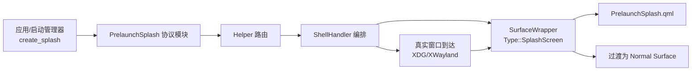
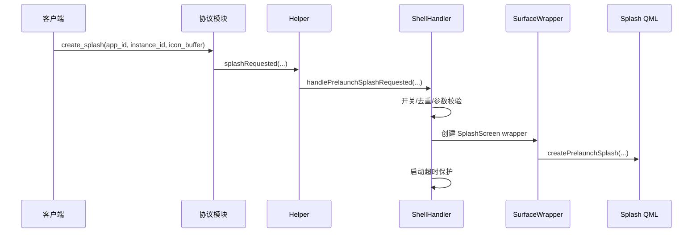
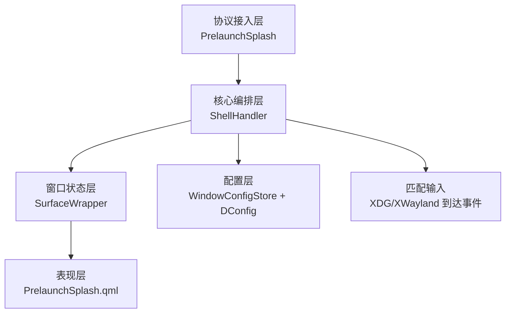

# Treeland 预启动闪屏专项设计说明（管理视角）

## 1. 文档定位
本文档面向 Treeland 管理人员、项目经理与跨团队协同角色，用于说明“预启动闪屏”能力的业务价值、系统结构、关键流程、风险与推进建议。文档采用决策友好表达，避免过度展开代码细节，但保留必要的实现锚点、流程图与关键片段，便于评审和里程碑跟踪。

## 2. 背景与目标
在应用冷启动阶段，真实窗口通常存在“可感知空窗期”。预启动闪屏的核心目标是缩短用户主观等待感，提升“点开即响应”的体验稳定性。该能力并不是替代应用启动性能优化，而是通过可控的视觉占位机制，在启动链路中提供连续反馈。

从管理视角看，本能力同时承担三个目标：第一，改善桌面流畅感与一致性；第二，建立可运营的配置能力（全局开关、超时、应用级主题策略）；第三，为后续启动体验治理提供统一入口（监控、调优、灰度）。

## 3. 业务价值与预期收益
预启动闪屏上线后，预期可在以下方面产生直接收益。首先是感知性能提升，用户在点击应用后能够立刻看到系统反馈，降低“是否点击成功”的不确定感。其次是体验一致性提升，系统在不同应用、不同启动时机下都能够提供统一风格的启动过渡。再次是问题收敛能力增强，窗口迟到、客户端异常退出、图标缺失等场景将从“黑屏等待”转为“有状态、可回收、可观察”的治理路径。

建议在后续版本中结合埋点观察以下指标：启动首反馈时延、闪屏残留率、超时清理比例、用户主动关闭比例、异常断连回收成功率。

## 4. 范围与边界
本设计仅覆盖 Treeland 仓内能力，包括协议服务端、核心编排、窗口过渡、QML 展示与配置读取，不覆盖 AM（dde-application-manager）等外部项目实现细节。AM 在本设计中仅作为调用方和联调对象存在，任何功能判定均以 Treeland 当前分支源码为准。

## 5. 总体结构设计
预启动闪屏采用“协议触发 + 核心编排 + 包装过渡 + UI 展示”的四层结构。客户端通过 Wayland 协议发起请求，协议模块将请求转为内部信号，ShellHandler 做策略判断并创建 Splash 类型窗口包装，随后由 QML 组件完成视觉呈现。在真实窗口到达后，同一包装体进行状态切换，完成闪屏退出与真实窗口接管。



管理层可将该结构理解为“一次请求，两段生命周期”：第一段展示占位，第二段无缝切换到真实窗口。

## 6. 模块职责（管理摘要）
协议模块位于 `src/modules/prelaunch-splash/`，负责对外暴露 `treeland_prelaunch_splash_v2` 能力并接收创建/销毁请求。Helper 位于 `src/seat/helper.cpp`，承担协议事件到核心逻辑的路由。ShellHandler 位于 `src/core/shellhandler.*`，负责去重、超时、匹配与销毁策略，是策略中枢。SurfaceWrapper 位于 `src/surface/surfacewrapper.*`，负责 splash 到真实窗口的状态转换。QML 组件位于 `src/core/qml/PrelaunchSplash.qml`，负责视觉展示与销毁回调。配置模块位于 `misc/dconfig/` 和 `src/core/windowconfigstore.*`，负责全局与应用级策略配置。

## 7. 关键流程设计

### 7.1 创建流程
创建流程以“快速反馈”为原则。客户端发起 `create_splash` 后，协议层创建对象并触发内部事件；ShellHandler 进行开关、合法性和重复判断；判断通过后创建 Splash 包装体并展示 UI，同时启动超时保护计时器，避免异常场景下长时间残留。



### 7.2 过渡流程
真实窗口到达后，系统执行匹配并尝试复用原 splash 包装体，降低跳变感和管理复杂度。匹配成功后调用 `convertToNormalSurface()`，随后触发 splash 隐藏并完成状态收尾。如果匹配失败则回退到常规窗口创建路径。

### 7.3 关闭与回收流程
系统支持三类关闭路径：客户端主动销毁、超时自动销毁、客户端异常断连清理。管理上需要关注的是“是否所有路径都能收口到可回收状态”，这是稳定性指标的核心。

## 8. 关键策略与容错机制
当前设计采取了多重保护机制以降低线上风险。第一是重复请求保护，同一应用在短窗口内重复触发时不会无限创建占位窗口。第二是超时保护，防止真实窗口长期未到导致残留。第三是对象有效性保护，通过弱引用规避异步回调的悬挂访问。第四是空图标降级，图标缓冲缺失时仍可显示占位样式，不阻断主流程。

## 9. 配置与可运营性
该能力具备可运营配置基础。全局侧包含 `enablePrelaunchSplash` 和 `prelaunchSplashTimeoutMs`，用于控制是否启用与超时阈值。应用侧支持开关、历史尺寸、主题类型与调色板。该配置结构意味着后续可按应用类别、版本阶段和灰度策略做差异化控制，为发布治理提供抓手。

## 10. 风险分析（管理重点）

### 10.1 主要风险
主要风险集中在四类：第一是残留风险，即窗口未到但闪屏未清理；第二是匹配风险，即真实窗口和占位窗口关联不准导致切换异常；第三是资源风险，即缓冲或对象在异常路径未及时释放；第四是体验风险，即视觉风格与主题策略不一致造成“突兀感”。

### 10.2 缓解措施
针对上述风险，建议持续执行“监控 + 回收 + 测试”三位一体策略。监控层面补齐关键生命周期日志和统计指标；回收层面确保断连、超时、主动关闭三条路径闭环；测试层面覆盖并发、空图标、mapped 前后切换和异常断连场景。

## 11. 里程碑与验收建议
建议分三阶段推进。第一阶段完成主链路可用（创建、展示、过渡、回收）；第二阶段补齐可运营能力（配置治理、日志标准化、指标上报）；第三阶段提升体验质量（主题一致性、动画细节、异常观感优化）。

验收建议采用“功能验收 + 稳定性验收 + 体验验收”三套口径。功能验收关注链路是否闭环，稳定性验收关注残留率和异常回收成功率，体验验收关注响应时延与视觉一致性。

## 12. 关键代码片段（用于评审定位）
以下片段用于帮助管理与评审人员理解关键实现点，不作为完整代码阅读入口。

协议层创建与回收（`src/modules/prelaunch-splash/prelaunchsplash.cpp`）：

```cpp
void treeland_prelaunch_splash_manager_v2_create_splash(...)
{
    auto *splashResource = wl_resource_create(...);
    if (!splashResource) {
        wl_resource_post_no_memory(resource->handle);
        return;
    }
    new SplashResource(q, splashResource, app_id, instance_id);
    Q_EMIT q->splashRequested(app_id, instance_id, qb);
}
```

窗口过渡核心（`src/surface/surfacewrapper.cpp`）：

```cpp
void SurfaceWrapper::convertToNormalSurface(WToplevelSurface *shellSurface, Type type)
{
    if (m_type != Type::SplashScreen || m_shellSurface != nullptr) {
        qCCritical(treelandSurface) << "invalid state";
        return;
    }
    m_shellSurface = shellSurface;
    m_type = type;
    setup();
    QMetaObject::invokeMethod(m_prelaunchSplash, "hideAndDestroy", Qt::QueuedConnection);
}
```

QML 销毁通知（`src/core/qml/PrelaunchSplash.qml`）：

```qml
function hideAndDestroy() {
    if (!splash.visible)
        return
    splash.visible = false
    splash.destroyRequested()
}
```

## 13. 结构图（管理版）



该结构体现了“控制面”和“表现面”分离：ShellHandler 负责策略，QML 负责展示，配置层负责可运营性。

## 14. 关联文件（审阅索引）
为便于管理与评审追踪，建议重点关注以下文件：`src/modules/prelaunch-splash/prelaunchsplash.h`、`src/modules/prelaunch-splash/prelaunchsplash.cpp`、`src/seat/helper.cpp`、`src/core/shellhandler.h`、`src/core/shellhandler.cpp`、`src/surface/surfacewrapper.h`、`src/surface/surfacewrapper.cpp`、`src/core/qml/PrelaunchSplash.qml`、`src/core/windowconfigstore.h`、`src/core/windowconfigstore.cpp`、`misc/dconfig/org.deepin.dde.treeland.json`、`misc/dconfig/org.deepin.dde.treeland.app.json`、`tests/test_protocol_prelaunch-splash/main.cpp`。

## 15. 结论
预启动闪屏是 Treeland 启动体验治理中的关键能力，具备明确业务价值与可运营潜力。当前设计已形成完整主链路和基础容错框架，下一步重点应从“可用”转向“可观测、可治理、可规模化优化”。在管理层面，建议将其纳入启动体验专项里程碑，并与质量指标、灰度策略和跨团队联调机制绑定推进。