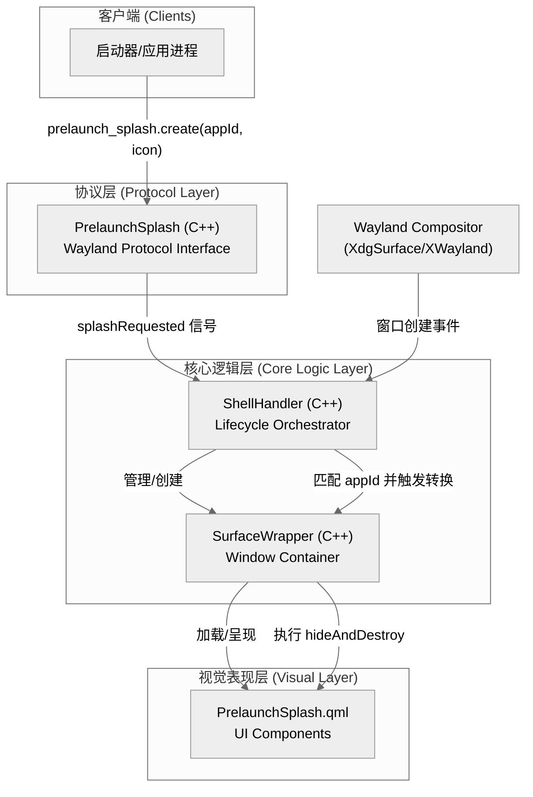
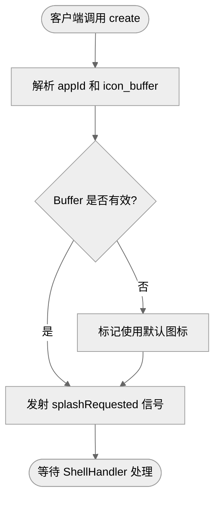
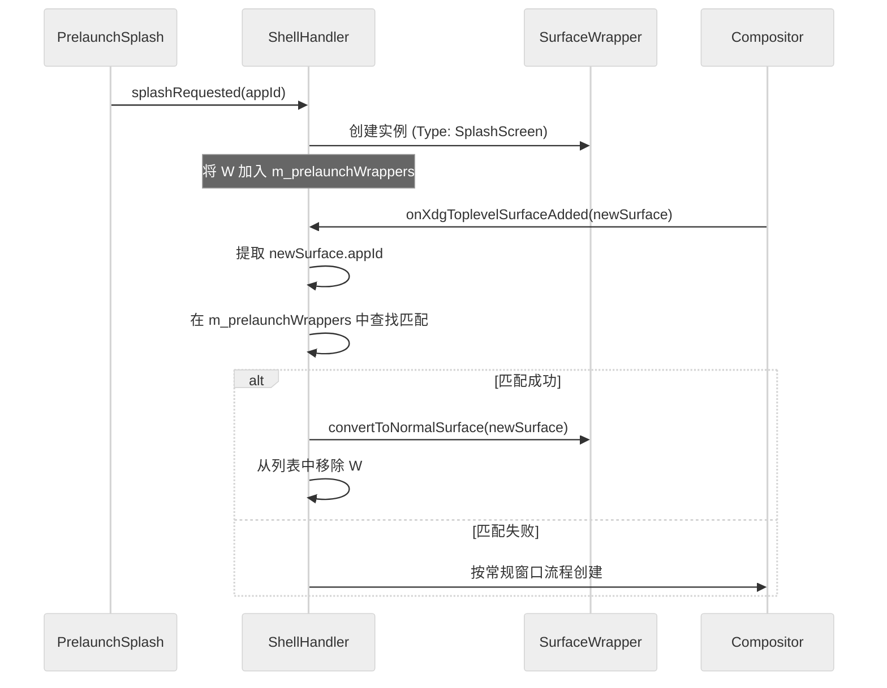
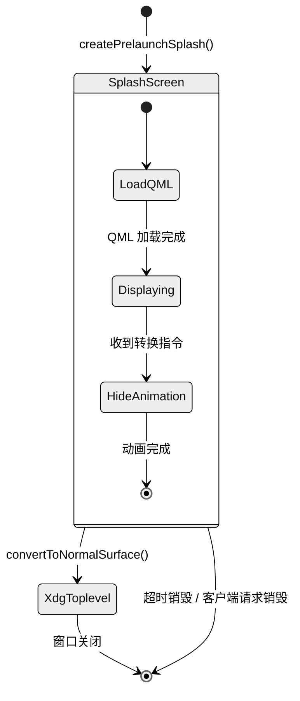
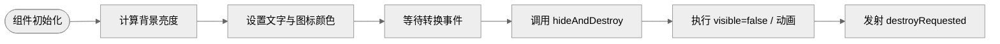

# 4 系统模块设计

## 4.1 系统架构总览


**图 4-1 Treeland 闪屏功能系统架构图**

Treeland 闪屏功能基于事件驱动的响应式架构设计，旨在填补应用启动指令发出到首帧窗口渲染之间的视觉空白。系统架构主要由协议解析层、逻辑编排层、容器管理层和视觉表现层组成。

1.  **外部依赖关系**：本功能深度依赖 `waylib` 框架提供的 Wayland 服务端抽象，利用 `wroots` 处理底层 Buffer 渲染。UI 部分通过 Qt Quick 渲染引擎实现，利用 QML 的动态特性完成从占位符到真实窗口的无缝过渡。
2.  **客户端通信机制**：采用自定义 Wayland 协议 `prelaunch-splash`。客户端（如启动器）通过该协议向服务端发送应用标识（appId）、图标数据（iconBuffer）及背景偏好；服务端监听协议请求并实时更新闪屏状态。
3.  **内部模块协作关系**：`PrelaunchSplash` 模块解析协议并向 `ShellHandler` 发送请求信号。`ShellHandler` 作为核心编排器，负责实例化 `SurfaceWrapper` 并将其标记为 `SplashScreen` 类型。当真实的 `XdgSurface` 或 `XWaylandSurface` 到达时，`ShellHandler` 通过 `appId` 进行匹配，并驱动 `SurfaceWrapper` 执行类型转换与内容替换。
4.  **技术栈分层**：
    *   **协议层**：C++ / Wayland Server Protocol，负责高效的数据交换。
    *   **核心逻辑层**：C++ / Qt (Object Model)，处理生命周期、匹配算法与状态机转换。
    *   **表现层**：QML / JavaScript，负责 GPU 加速的视觉渲染与转场动画。

---

## 4.2 各子模块详述

### 4.2.1 协议接口模块 (PrelaunchSplash)

#### 模块功能
协议接口模块负责实现 `prelaunch-splash` Wayland 协议的服务端逻辑，是外部通信的唯一入口。
- 协议全局对象管理
- 客户端请求拦截与解析
- 图标 Buffer 对象的生命周期跟踪
- 闪屏销毁指令的跨进程转发

该模块继承自 `WAYLIB_SERVER_NAMESPACE::WServerInterface`，通过绑定 Wayland Display 将自定义协议暴露给客户端，并将抽象的协议请求转化为 C++ 强类型信号。

#### 主要接口
**类：PrelaunchSplash**
该类负责管理协议的全局生命周期及资源绑定。

*   **信号**
    *   当客户端请求创建闪屏时触发：`splashRequested(const QString &appId, const QString &instanceId, QW_NAMESPACE::qw_buffer *iconBuffer)`
    *   当客户端主动要求关闭闪屏时触发：`splashCloseRequested(const QString &appId, const QString &instanceId)`

#### 逻辑流程


**图 4-2 协议请求处理流程**

1.  当客户端调用协议接口发送 `create` 请求时，`PrelaunchSplash` 会拦截该请求。
2.  `PrelaunchSplash` 提取请求中的 `appId` 和 `icon_buffer` 资源。
3.  `PrelaunchSplash` 发射 `splashRequested` 信号。
4.  信号被 `ShellHandler` 模块接收并触发后续创建流程。

#### 错误处理
1.  [非法 Buffer 资源]：若客户端发送的图标 Buffer 无效，系统会忽略该 Buffer 并继续使用默认占位图展示。
2.  [重复创建请求]：当针对同一 `appId` 的重复创建请求到达时，系统会根据 `instanceId` 进行幂等处理，避免创建多个占位窗口。

---

### 4.2.2 生命周期编排模块 (ShellHandler)

#### 模块功能
生命周期编排模块是闪屏功能的控制中心，负责协调各组件的协同工作。
- 闪屏 Wrapper 的实例化管理
- 占位窗口与真实窗口的匹配算法实现
- 闪屏超时机制维护
- 挂起请求的队列管理

`ShellHandler` 维护一个 `m_prelaunchWrappers` 列表，记录所有处于活跃状态的闪屏容器，并监听工作区的窗口添加事件以执行匹配。

#### 主要接口
**类：ShellHandler**
该类通过对窗口事件的全局监听，实现闪屏全生命周期的自动化管理。

*   **方法（内部调用）**
    *   `void handlePrelaunchSplashRequested(...)`: 响应协议层信号并启动创建逻辑。
    *   `void createPrelaunchSplash(...)`: 实例化具有闪屏属性的容器对象。
    *   `void ensureXdgWrapper(...)`: 在真实窗口到达时，尝试从 `m_prelaunchWrappers` 中查找匹配项。
    *   `void handlePrelaunchSplashClosed(...)`: 响应关闭请求并清理相关资源。

#### 逻辑流程


**图 4-3 窗口匹配与状态转换流程**

1.  当 `onXdgToplevelSurfaceAdded` 信号触发时，`ShellHandler` 获取新窗口的 `appId`。
2.  `ShellHandler` 遍历 `m_prelaunchWrappers` 列表。
3.  当发现 appId 匹配的 Wrapper 时，`ShellHandler` 将其从列表中移除。
4.  `ShellHandler` 调用匹配到的 Wrapper 的 `convertToNormalSurface` 方法，完成从闪屏到真实窗口的身份切换。

#### 错误处理
1.  [超时未到达]：当闪屏创建后超过预设时间（如 10s）仍无真实窗口匹配，系统会触发自动销毁策略以释放资源。
2.  [匹配失败]：对于无法匹配到闪屏的真实窗口，系统会按照常规流程创建新的 `SurfaceWrapper`，不会影响正常窗口展示。

---

### 4.2.3 窗口容器模块 (SurfaceWrapper)

#### 模块功能
窗口容器模块是 Treeland 中所有窗口的通用载体，支持动态类型转换。
- 多类型窗口状态维护
- QML 闪屏组件的动态加载与卸载
- 窗口元数据（appId、几何尺寸）的管理
- 渲染内容的平滑切换（从 QML 到 Wayland Surface）

`SurfaceWrapper` 在 `Type::SplashScreen` 状态下仅充当一个 UI 容器，不绑定任何底层 Wayland Surface 资源。

#### 主要接口
**类：SurfaceWrapper**
该类定义了窗口的视觉与行为边界，支持从闪屏到普通窗口的无缝过渡。

*   **枚举：Type**
    *   `SplashScreen`: 闪屏占位状态
    *   `XdgToplevel`: 标准 XDG 窗口状态

*   **属性**
    *   `type: Read-only`, 当前容器的类型状态。
    *   `appId: Read-only`, 关联的应用标识。
    *   `prelaunchSplash: Read-only`, 指向当前加载的 QML 闪屏对象。

*   **方法**
    *   `void convertToNormalSurface(WToplevelSurface *shellSurface, Type type)`: 执行类型转换，将底层内容替换为真实的 shell surface。
    *   `void requestCloseSplash()`: 发送关闭闪屏界面的内部请求。

#### 逻辑流程


**图 4-4 容器内部状态转换逻辑**

1.  当 `convertToNormalSurface` 被调用时，`SurfaceWrapper` 标记内部状态为 `Type::XdgToplevel`。
2.  容器通过 `setup()` 初始化真实的 `WSurfaceItem`。
3.  系统通知 `prelaunchSplash` 组件执行隐藏动画。
4.  当动画结束或内容就绪后，真实的窗口内容覆盖闪屏层。

#### 错误处理
1.  [组件加载失败]：若 `PrelaunchSplash.qml` 加载失败，容器会保持透明并记录错误日志，等待真实窗口渲染。
2.  [无效转换请求]：对于非 `SplashScreen` 类型的容器调用转换接口，系统将直接忽略请求。

---

### 4.2.4 界面呈现模块 (PrelaunchSplash.qml)

#### 模块功能
界面呈现模块定义了闪屏的视觉表现与交互动画。
- 应用图标与背景色的自适应展示
- 加载文案的多语言呈现
- 深浅色主题适配
- 退出淡出动画实现

该模块通过 `BufferItem` 直接渲染 Wayland Client 提供的图标数据，确保图标质量与原始资源一致。

#### 主要接口
**代码块：QML 属性与方法**
```qml
// 属性
property real initialRadius    // 窗口圆角半径
property var iconBuffer        // 图标 Buffer 数据源
property color backgroundColor // 背景颜色
readonly property bool isLightBackground // 是否为浅色背景（计算属性）

// 信号
signal destroyRequested()      // 界面准备销毁时触发

// 方法
function hideAndDestroy()      // 执行隐藏视觉逻辑并请求销毁
```

#### 逻辑流程


**图 4-5 界面展示与消失流程**

1.  当组件初始化时，系统根据 `backgroundColor` 亮度自动调整文字颜色。
2.  当 `iconBuffer` 可用时，`BufferItem` 呈现图标；否则展示默认占位图。
3.  当收到销毁指令时，界面执行 `hideAndDestroy` 逻辑。
4.  界面将 `visible` 置为 `false` 并发射 `destroyRequested` 信号，触发容器层的资源清理。

#### 错误处理
1.  [Buffer 数据丢失]：当协议提供的 `iconBuffer` 在渲染前被销毁时，系统会自动回退到默认的应用占位图标。
2.  [重复销毁调用]：若多次调用 `hideAndDestroy`，系统会检查当前可见性状态，避免重复触发销毁信号。
