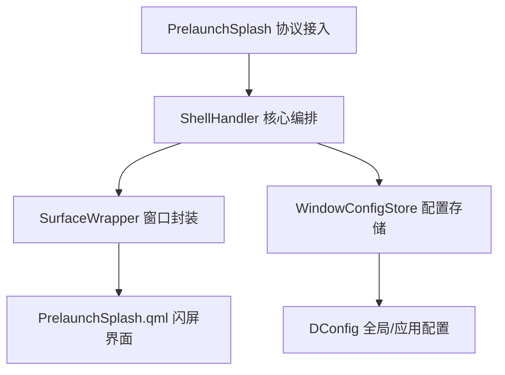

## 3. 全局数据结构设计

主要数据结构包括：

1. PrelaunchSplash（预启动闪屏协议管理类）：继承自 `QObject` 与 `WServerInterface`，核心职责是创建 Wayland 协议全局对象并转发闪屏创建/关闭事件。
2. ShellHandler（系统编排类）：继承自 `QObject`，核心职责是创建和管理窗口编排链路，协调预启动闪屏与真实窗口接管。
3. SurfaceWrapper（窗口/表面封装类）：继承自 `QQuickItem`，核心职责是封装窗口状态、容器归属与几何信息，并支持 Splash 到真实窗口的状态切换。
4. WindowConfigStore（窗口配置存储类）：继承自 `QObject`，核心职责是获取和更新应用级窗口尺寸及闪屏主题配置。

### 3.1 接口详情

#### 1. PrelaunchSplash：继承自 `QObject` 与 `WAYLIB_SERVER_NAMESPACE::WServerInterface`，核心功能是创建协议全局对象并转发预启动闪屏事件。

##### 容器结构管理

`PrelaunchSplash(QObject *parent = nullptr)`  
功能：创建协议管理对象并设置对象父级。  
参数：`parent`：`QObject *`，父对象指针。

`~PrelaunchSplash()`  
功能：删除协议管理对象并释放关联资源。

##### 状态查询

`global() const`  
功能：获取当前协议全局对象句柄（只读）。  
返回：`wl_global *`，Wayland 全局对象指针。

`interfaceName() const`  
功能：获取当前协议接口名称（只读）。  
返回：`QByteArrayView`，协议接口名视图。

##### 其他功能

`create(WAYLIB_SERVER_NAMESPACE::WServer *server)`  
功能：创建协议全局对象并注册到服务端。  
参数：`server`：`WServer *`，Wayland 服务端实例。

`destroy(WAYLIB_SERVER_NAMESPACE::WServer *server)`  
功能：删除协议全局对象并从服务端解绑。  
参数：`server`：`WServer *`，Wayland 服务端实例。

##### 信号通知（Signal）

`splashRequested(const QString &appId, const QString &instanceId, QW_NAMESPACE::qw_buffer *iconBuffer)`  
触发时机：创建预启动闪屏请求被协议层接收后触发。  
参数：`appId`：`QString`，应用标识。`instanceId`：`QString`，实例标识。`iconBuffer`：`qw_buffer *`，图标缓冲区指针。

`splashCloseRequested(const QString &appId, const QString &instanceId)`  
触发时机：客户端主动销毁或异常断连导致协议对象销毁时触发。  
参数：`appId`：`QString`，应用标识。`instanceId`：`QString`，实例标识。

#### 2. ShellHandler：继承自 `QObject`，核心功能是创建并管理桌面窗口编排链路，协调预启动闪屏与真实窗口生命周期。

##### 容器结构管理

`ShellHandler(RootSurfaceContainer *rootContainer, WAYLIB_SERVER_NAMESPACE::WServer *server)`  
功能：创建编排对象并设置根容器与服务端上下文。  
参数：`rootContainer`：`RootSurfaceContainer *`，根容器指针。`server`：`WServer *`，服务端指针。

`workspace() const`  
功能：获取当前工作区容器（只读）。  
返回：`Workspace *`，当前工作区对象指针。

##### 表面/对象管理

`createComponent(QmlEngine *engine, QQuickItem *parentItem)`  
功能：创建编排层依赖的 QML 组件对象。  
参数：`engine`：`QmlEngine *`，QML 引擎对象。`parentItem`：`QQuickItem *`，父级渲染节点。

`initXdgShell(WAYLIB_SERVER_NAMESPACE::WServer *server)`  
功能：创建并启动 XDG Shell 监听。  
参数：`server`：`WServer *`，服务端对象。

##### 信号通知（Signal）

`surfaceWrapperAdded(SurfaceWrapper *wrapper)`  
触发时机：创建新窗口封装对象并完成接入后触发。  
参数：`wrapper`：`SurfaceWrapper *`，新增窗口封装对象。

`surfaceWrapperAboutToRemove(SurfaceWrapper *wrapper)`  
触发时机：删除窗口封装对象前触发。  
参数：`wrapper`：`SurfaceWrapper *`，待删除窗口封装对象。

#### 3. SurfaceWrapper：继承自 `QQuickItem`，核心功能是统一管理窗口/表面状态、几何和容器关系，并提供预启动闪屏切换能力。

##### 容器结构管理

`SurfaceWrapper(QmlEngine *qmlEngine, WToplevelSurface *shellSurface, Type type, const QString &appId = QString(), QQuickItem *parent = nullptr)`  
功能：创建普通窗口封装对象并设置基础上下文。  
参数：`qmlEngine`：`QmlEngine *`，QML 引擎对象。`shellSurface`：`WToplevelSurface *`，顶层表面对象。`type`：`Type`，封装类型。`appId`：`QString`，应用标识。`parent`：`QQuickItem *`，父节点。

`SurfaceWrapper(QmlEngine *qmlEngine, QQuickItem *parent, const QSize &initialSize, const QString &appId, QW_NAMESPACE::qw_buffer *iconBuffer = nullptr, const QColor &backgroundColor = QColor("#ffffff"))`  
功能：创建预启动闪屏封装对象并设置初始尺寸与图标。  
参数：`qmlEngine`：`QmlEngine *`，QML 引擎对象。`parent`：`QQuickItem *`，父节点。`initialSize`：`QSize`，初始窗口尺寸。`appId`：`QString`，应用标识。`iconBuffer`：`qw_buffer *`，图标缓冲区。`backgroundColor`：`QColor`，背景颜色。

`addSubSurface(SurfaceWrapper *surface)`  
功能：添加子表面封装对象。  
参数：`surface`：`SurfaceWrapper *`，子对象指针。

`removeSubSurface(SurfaceWrapper *surface)`  
功能：移除子表面封装对象。  
参数：`surface`：`SurfaceWrapper *`，子对象指针。

`subSurfaces() const`  
功能：获取全部子表面封装对象集合（只读）。  
返回：`const QList<SurfaceWrapper *> &`，子表面列表只读引用。

##### 表面/对象管理

`surface() const`  
功能：获取底层 `WSurface` 对象（只读）。  
返回：`WSurface *`，底层表面对象指针。

`shellSurface() const`  
功能：获取顶层 `WToplevelSurface` 对象（只读）。  
返回：`WToplevelSurface *`，顶层表面对象指针。

`surfaceItem() const`  
功能：获取渲染 `WSurfaceItem` 对象（只读）。  
返回：`WSurfaceItem *`，表面渲染对象指针。

`prelaunchSplash() const`  
功能：获取预启动闪屏 QML 对象（只读）。  
返回：`QQuickItem *`，闪屏对象指针。

`close()`  
功能：关闭当前窗口封装对象对应的客户端窗口。

`resize(const QSizeF &size)`  
功能：更新窗口尺寸。  
参数：`size`：`QSizeF`，目标尺寸。  
返回：`bool`，是否更新成功。

`setOutputs(const QList<WOutput *> &outputs)`  
功能：设置窗口输出目标列表。  
参数：`outputs`：`QList<WOutput *>`，输出设备列表。

`outputs() const`  
功能：获取窗口输出目标列表（只读）。  
返回：`const QList<WOutput *> &`，输出设备列表只读引用。

##### 状态查询

`type() const`  
功能：获取窗口封装类型（只读）。  
返回：`Type`，窗口类型枚举值。

`appId() const`  
功能：获取应用标识（只读）。  
返回：`QString`，应用标识字符串。

`geometry() const`  
功能：获取当前窗口几何信息（只读）。  
返回：`QRectF`，当前几何矩形。

`normalGeometry() const`  
功能：获取普通态窗口几何信息（只读）。  
返回：`QRectF`，普通态几何矩形。

`surfaceState() const`  
功能：获取窗口状态（只读）。  
返回：`State`，窗口状态枚举值。

`container() const`  
功能：获取当前容器对象（只读）。  
返回：`SurfaceContainer *`，容器对象指针。

`isActivated() const`  
功能：获取窗口激活状态（只读）。  
返回：`bool`，是否处于激活态。

##### 其他功能

`setSurfaceState(State newSurfaceState)`  
功能：切换窗口状态。  
参数：`newSurfaceState`：`State`，目标状态。

`setAlwaysOnTop(bool alwaysOnTop)`  
功能：设置窗口置顶状态。  
参数：`alwaysOnTop`：`bool`，是否置顶。

`setNoDecoration(bool newNoDecoration)`  
功能：设置窗口是否启用装饰。  
参数：`newNoDecoration`：`bool`，是否禁用装饰。

`setFocus(bool focus, Qt::FocusReason reason)`  
功能：设置窗口焦点状态。  
参数：`focus`：`bool`，是否获取焦点。`reason`：`Qt::FocusReason`，焦点变更原因。

##### 信号通知（Signal）

`prelaunchSplashChanged()`  
触发时机：更新预启动闪屏对象后触发。

`typeChanged()`  
触发时机：切换窗口封装类型后触发。

`appIdChanged()`  
触发时机：更新应用标识后触发。

`surfaceItemCreated()`  
触发时机：创建渲染表面对象后触发。

`surfaceStateChanged()`  
触发时机：切换窗口状态后触发。

`requestCloseSplash()`  
触发时机：发起关闭预启动闪屏请求时触发。

#### 4. WindowConfigStore：继承自 `QObject`，核心功能是获取和更新应用级窗口尺寸与闪屏主题配置。

##### 容器结构管理

`WindowConfigStore(QObject *parent = nullptr)`  
功能：创建配置存储对象并设置父对象。  
参数：`parent`：`QObject *`，父对象指针。

##### 表面/对象管理

`saveLastSize(const QString &appId, const QSize &size)`  
功能：更新应用的上次窗口尺寸配置。  
参数：`appId`：`QString`，应用标识。`size`：`QSize`，窗口尺寸。

##### 其他功能

`withSplashConfigFor(const QString &appId, QObject *context, std::function<void(const QSize &size, const QString &darkPalette, const QString &lightPalette, qlonglong splashThemeType)> callback, std::function<void()> skipCallback) const`  
功能：获取应用的闪屏配置并在可用时触发回调。  
参数：`appId`：`QString`，应用标识。`context`：`QObject *`，回调上下文对象。`callback`：`std::function<...>`，配置可用时回调。`skipCallback`：`std::function<void()>`，配置不可用时回调。

### 3.2 配置文件

文件名：`misc/dconfig/org.deepin.dde.treeland.json`
使用框架：`DConfig`（DTK 配置体系）
关键配置项：`enablePrelaunchSplash`（全局开关）。`prelaunchSplashTimeoutMs`（超时回收毫秒数）。

```json
{
    "contents": {
        "enablePrelaunchSplash": {
            "value": true
        },
        "prelaunchSplashTimeoutMs": {
            "value": 5000
        }
    }
}
```

文件名：`misc/dconfig/org.deepin.dde.treeland.app.json`
使用框架：`DConfig`（DTK 配置体系，通过 `WindowConfigStore` 访问）
关键配置项：`enablePrelaunchSplash`（应用级开关）。`lastWindowWidth`（上次窗口宽度）。`lastWindowHeight`（上次窗口高度）。`splashThemeType`（闪屏主题策略）。`splashDarkPalette`（暗色背景）。`splashLightPalette`（亮色背景）。

```json
{
    "contents": {
        "enablePrelaunchSplash": { "value": true },
        "lastWindowWidth": { "value": 800 },
        "lastWindowHeight": { "value": 600 },
        "splashThemeType": { "value": 0 },
        "splashDarkPalette": { "value": "#181818" },
        "splashLightPalette": { "value": "#FFFFFF" }
    }
}
```

### 3.3 模块使用情况

协议接入模块使用 `PrelaunchSplash` 获取创建/关闭事件，并把事件转交编排层。
核心编排模块使用 `ShellHandler` 创建和管理 `SurfaceWrapper`，并在真实窗口到达时切换窗口状态。
窗口状态模块使用 `SurfaceWrapper` 统一管理窗口几何、输出、状态与闪屏占位对象。
配置治理模块使用 `WindowConfigStore` 获取和更新每个应用的闪屏与窗口尺寸策略。



上图表示协议事件先进入 `PrelaunchSplash`，再由 `ShellHandler` 统一编排；`ShellHandler` 一方面驱动 `SurfaceWrapper` 管理窗口状态，另一方面通过 `WindowConfigStore` 获取策略配置，最终由 QML 层呈现闪屏界面。

整体来看，这四类数据结构形成了“协议输入、编排决策、状态承载、配置驱动”的协作关系：`PrelaunchSplash` 负责输入边界，`ShellHandler` 负责流程调度，`SurfaceWrapper` 负责运行态对象承载，`WindowConfigStore` 负责策略数据支撑，四者共同保证预启动闪屏链路的可扩展性和可治理性。