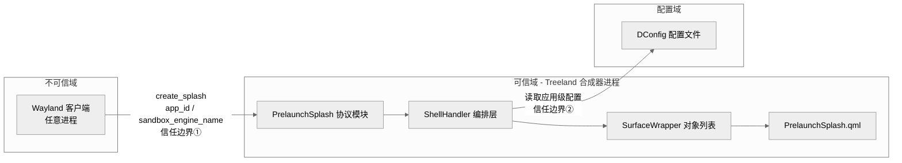

## 3. 安全风险分析

### 3.1 概述

本章节依据 STRIDE 威胁建模模型，对窗口启动画面（Window Splash Screen）能力进行系统化安全分析，识别核心资产、标定信任边界、量化风险等级并给出消减措施。

窗口启动画面能力的整体风险处于中低水平。其关键前提是：协议的预期调用方为 DDE 自研组件 dde-application-manager（AM），而非普通图形客户端。AM 在应用进程启动之前即掌握准确的 `appId`，因此其提供的标识可信度显著高于客户端自行上报的场景。然而，协议层本身并不强制校验调用方身份，任何持有 Wayland socket 访问权限的进程均可发起 `create_splash` 请求，这是本模型中的核心信任边界。

### 3.2 资产识别

#### 3.2.1 数据流与信任边界

信任边界① 是本系统最主要的攻击面，穿过此边界的数据包括 `app_id`、`instance_id` 和 `sandboxEngineName`，全部来自不可信客户端进程。AM 已在 v2 实现中将 `sandboxEngineName` 固定传入 `"dde-application-manager"`，但 treeland 协议层当前不对该字段做身份校验，仅记录日志。信任边界② 涉及从本地文件系统读取配置，需防范文件权限异常。

#### 3.2.2 关键资产清单

| 资产 ID | 资产名称 | 资产类型 | 描述与关键属性 |
|---------|---------|---------|--------------|
| AS-01 | Wayland 协议接口 `treeland_prelaunch_splash_v2` | 通信渠道 | 系统接收外部输入的唯一入口，无调用方身份验证，监听 Wayland socket |
| AS-02 | `app_id` / `instance_id` 参数 | 数据 | 由客户端自行提供，用于窗口匹配；若伪造，可导致错误接管或 DoS |
| AS-03 | ShellHandler 启动画面对象列表 | 进程状态 | 保存活跃的 SplashScreen wrapper 实例，用于窗口匹配；若耗尽则影响正常应用启动 |
| AS-04 | DConfig 应用级配置 | 存储 | 应用窗口尺寸、主题配置；若异常可导致启动画面展示错误，不直接涉及权限提升 |

### 3.3 威胁分析

依据 STRIDE 模型对上述资产逐一分析：

| 编号 | 关联资产 | STRIDE | 威胁描述（攻击场景） |
|------|---------|--------|------------------|
| T-01 | AS-01、AS-02 | S（仿冒） | 恶意 Wayland 客户端伪造 `app_id`，提前为目标应用创建启动画面占位，导致真实窗口匹配到错误 wrapper，欺骗用户感知到异常的启动过程。`sandboxEngineName` 字段由调用方自填，treeland 当前不做校验，无法凭此鉴别 AM 与仿冒者 |
| T-02 | AS-04 | T（篡改） | 攻击者获得文件写权限后篡改 DConfig 配置，覆盖 `lastWindowWidth`/`lastWindowHeight` 为极端值，导致启动画面窗口尺寸异常影响用户体验 |
| T-03 | AS-01 | R（抵赖） | 协议入口未记录足够的调用方信息（如 PID / UID），攻击者发起恶意启动画面请求后无法溯源追责 |
| T-04 | AS-02、AS-03 | D（拒绝服务） | 恶意客户端短时间内大量调用 `create_splash`，淹没 ShellHandler 的启动画面对象列表，导致正常应用的启动画面请求无法处理或匹配超时 |
| T-05 | AS-03 | D（拒绝服务） | 恶意客户端创建大量启动画面对象后不发送 `destroy`，对象在超时前持续占用内存，造成合成器进程内存压力累积 |

### 3.4 风险评估与消减措施

风险等级 = 影响程度（I）× 可能性（L），参照风险矩阵：高（6-9）、中（3-4）、低（1-2）。

| 威胁编号 | 影响程度 (I) | 可能性 (L) | 风险等级 | 消减措施 |
|---------|------------|----------|---------|---------|
| T-01（appId 伪造） | 2（中，错误 UI 展示） | 2（桌面环境 Wayland socket 可访问） | **4（中）** | ① 近期：当前已依赖 AM 作为首要调用方，且 `app_id` 错误不影响安全权限边界。② 后续：结合 Wayland Security Context 协议或 D-Bus PolicyKit 限制 `treeland_prelaunch_splash_v2` 的可访问客户端范围 |
| T-02（配置篡改） | 1（忽略，仅影响 UI） | 1（需文件系统写权限） | **1（低）** | 确保 DConfig 配置文件权限遵循最小写入原则，非 root/同组用户不可修改 |
| T-03（抵赖） | 1（忽略） | 2（日志不足时） | **2（低）** | 在 `create_splash` 处理入口调用 `wl_client_get_credentials()`，以 Info 级别记录客户端 PID 与 UID，确保请求可溯源 |
| T-04（对象列表 DoS） | 2（影响正常应用启动） | 2（桌面环境可实施） | **4（中）** | ① 为单个 Wayland 客户端的并发启动画面对象数量设置上限（如每客户端不超过 N 个）。② ShellHandler 中设置全局启动画面对象总数硬上限，超出时拒绝新请求并记录告警 |
| T-05（内存耗尽 DoS） | 2（合成器内存压力） | 2（中等） | **4（中）** | ① 超时回收机制已存在，需确认超时值（`prelaunchSplashTimeoutMs`）配置合理。② 结合 T-04 的数量上限一并消减 |

### 3.5 残余风险声明

经过上述消减措施后，以下风险仍以可接受状态存在或需持续关注：

1. **协议访问控制残余风险**：在 Wayland Security Context 或等效机制落地之前，协议调用方身份依赖运营环境的隔离保障（如沙箱、玲珑容器），若桌面环境整体沙箱化不完整，仿冒 `appId` 的风险将持续存在。对策：在系统集成测试中验证非授权进程的协议访问是否被拦截。

   