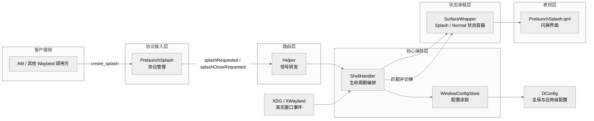
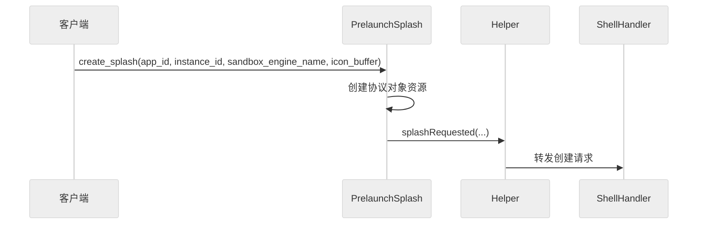
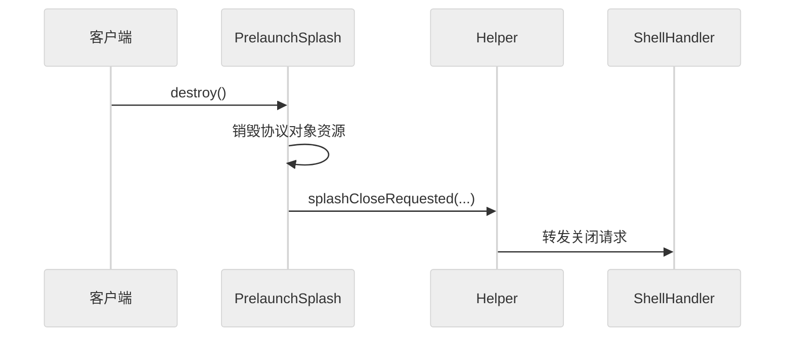
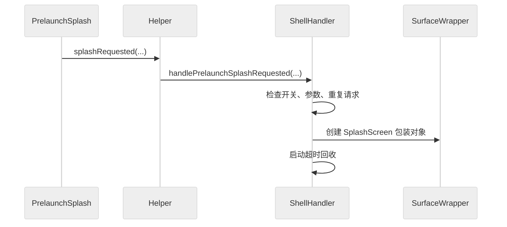
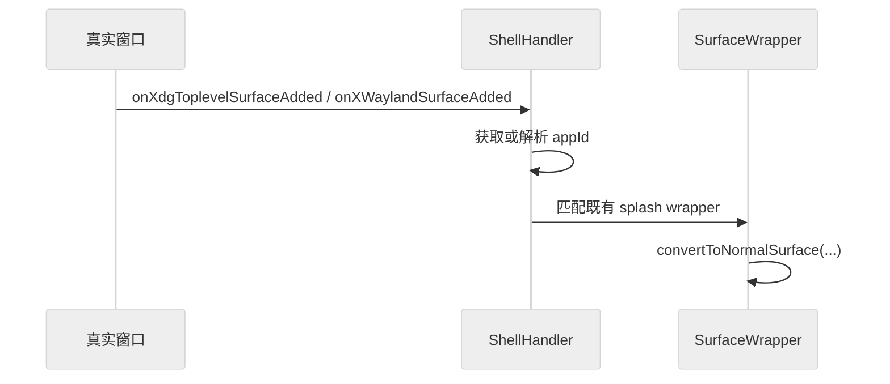
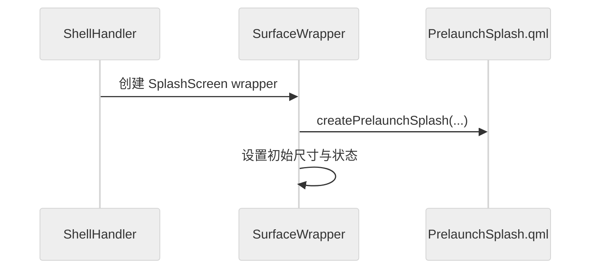
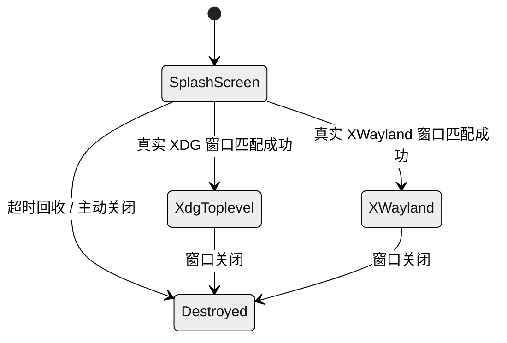
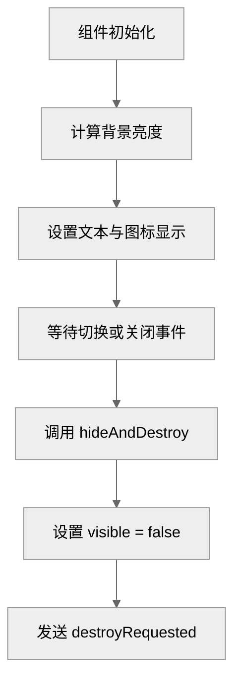
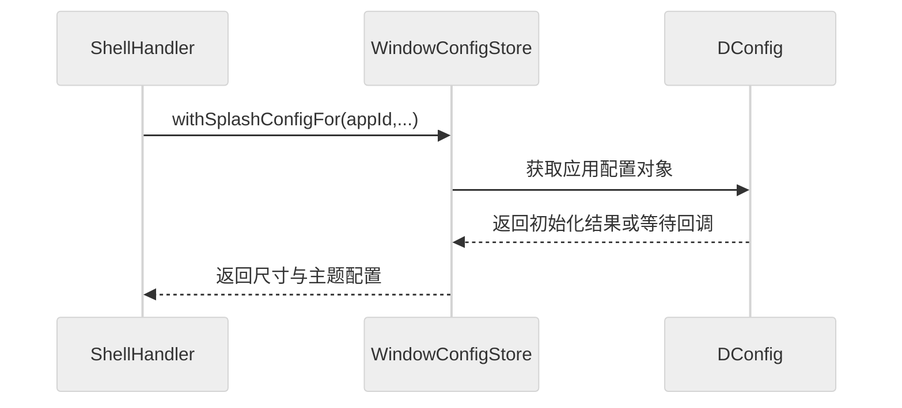

## 2. 系统模块设计

### 2.1 系统架构总览



图 2.1 预启动闪屏系统总体架构图

Treeland 预启动闪屏能力建立在 Qt6、QtQuick、Waylib、wlroots、QtWayland Server 与 DConfig 等基础设施之上。QtQuick 和 QML 负责构建界面对象与动画表现，Waylib 和 wlroots 负责底层表面、输出和合成能力，QtWayland Server 负责自定义 Wayland 协议服务端接入，DConfig 则负责全局配置与应用级配置存储。这些外部依赖共同支撑了预启动闪屏从协议接入、状态管理到界面呈现的完整链路。

客户端通信机制采用 Wayland 自定义协议 `treeland_prelaunch_splash_v2`。预期调用方为 dde-application-manager（AM），AM 在应用进程启动**之前**生成 UUID 作为 `instanceId`，随后调用 `create_splash(appId, instanceId, sandboxEngineName, iconBuffer)` 发起请求，并在实例退出时通过对象级 `destroy` 关闭闪屏。协议对象的创建和回收由 PrelaunchSplash 模块统一维护，Treeland 内部通过 Qt 信号将协议事件转交给核心编排模块处理，从而将客户端通信逻辑与业务逻辑解耦。

内部模块协作关系采用典型的分层式结构。PrelaunchSplash 模块负责接收协议请求并转化为内部事件；Helper 负责协议事件与 ShellHandler 之间的路由；ShellHandler 负责创建闪屏窗口包装对象、跟踪其生命周期，并在真实窗口到达后完成匹配与切换；SurfaceWrapper 负责承载预启动闪屏和真实窗口两个运行阶段；PrelaunchSplash.qml 负责具体视觉展示；WindowConfigStore 负责提供尺寸、主题和开关配置。整体协作方式是“协议触发、编排决策、状态切换、界面收尾”的事件驱动模型。

从技术分层角度看，该系统可划分为五层。协议接入层采用 Wayland 自定义协议与 QtWayland Server；路由层采用 Qt 对象模型和信号槽机制；核心编排层采用 C++ 和容器状态管理；状态承载层采用 QQuickItem 与 Wayland Surface 封装；表现层采用 QML 与 QtQuick Controls。各层之间遵循上层依赖下层、表现层依赖状态层、状态层依赖编排层的关系，从而保证职责单一、边界清晰。

### 2.2 各子模块详述

### 2.2.1 PrelaunchSplash 协议模块
#### 模块功能
PrelaunchSplash 协议模块是预启动闪屏能力的外部接入入口，负责向 Wayland 客户端暴露 `treeland_prelaunch_splash_v2` 服务端接口，并将协议事件转换为内部信号。

- 协议全局对象管理
- 闪屏创建请求接收
- 闪屏关闭请求接收
- 图标缓冲区转发
- 客户端断连清理
- 协议对象生命周期维护

该模块的核心类为 `PrelaunchSplash`。该类继承自 `QObject` 与 `WServerInterface`，因此既具备 Qt 事件分发能力，也具备 Wayland 服务端全局对象注册能力。协议资源的对象级行为由内部资源类承接，管理类主要负责公开接口与信号出口。

#### 主要接口
类：`PrelaunchSplash`。该类负责管理预启动闪屏协议全局对象，并把客户端请求转交给编排层。

协议管理
- `void create(WAYLIB_SERVER_NAMESPACE::WServer *server)`: 创建协议全局对象并注册到 Wayland 服务端。
- `void destroy(WAYLIB_SERVER_NAMESPACE::WServer *server)`: 删除协议全局对象并从 Wayland 服务端解绑。
- `wl_global * global() const`: 获取协议全局对象句柄。
- `QByteArrayView interfaceName() const`: 获取协议接口名称。

信号
- 当客户端请求创建闪屏时，系统会触发 `splashRequested(const QString &appId, const QString &instanceId, QW_NAMESPACE::qw_buffer *iconBuffer)`。
- 当客户端主动销毁对象或客户端断连导致对象销毁时，系统会触发 `splashCloseRequested(const QString &appId, const QString &instanceId)`。

#### 逻辑流程


图 2.2 PrelaunchSplash 协议创建流程图

1. 当客户端调用 `create_splash` 时，PrelaunchSplash 会解析请求参数并创建协议对象资源。
2. 当资源创建成功时，PrelaunchSplash 会提取 `app_id`、`instance_id`、`sandbox_engine_name` 和 `icon_buffer`，并发送 `splashRequested` 信号。
3. 当 Helper 接收到创建信号时，会将该事件转发给 ShellHandler 执行后续编排。



图 2.3 PrelaunchSplash 协议关闭流程图

1. 当客户端调用对象级 `destroy` 时，协议资源进入销毁流程。
2. 当协议对象销毁时，PrelaunchSplash 会统一发送 `splashCloseRequested` 信号。
3. 当 Helper 接收到关闭信号时，会把事件转发到 ShellHandler，由其执行回收或关闭流程。

#### 错误处理
1. 当协议资源创建失败时：系统会通过 `wl_resource_post_no_memory` 立即返回内存不足错误。
2. 当客户端异常断连时：系统会通过对象销毁回调统一触发关闭信号，以相同路径处理主动销毁和异常退出。
3. 对于重复销毁或销毁时机不确定的场景：系统通过 Wayland 资源生命周期机制处理，避免上层访问失效资源。

整体上，该模块采用“协议层最小职责”原则，只负责接收请求、创建资源与发出信号，不承担业务判断，从而降低错误扩散范围。

### 2.2.2 ShellHandler 编排模块
#### 模块功能
ShellHandler 模块是预启动闪屏链路的控制中心，负责在协议事件、真实窗口事件和配置数据之间建立协同关系，并维护闪屏对象的生命周期。

- 闪屏请求校验
- 闪屏包装对象创建
- 真实窗口匹配
- 状态切换编排
- 超时回收控制
- 工作区接入
- 生命周期通知

该模块的核心类为 `ShellHandler`。该类继承自 `QObject`，通过槽函数监听窗口创建与删除事件，通过内部列表跟踪预启动闪屏对象，并在真实窗口到达时决定是复用现有包装对象还是创建普通窗口包装对象。

#### 主要接口
类：`ShellHandler`。该类负责协调闪屏创建、匹配和回收流程。

编排初始化
- `Workspace * workspace() const`: 获取当前工作区对象。
- `void createComponent(QmlEngine *engine, QQuickItem *parentItem)`: 创建编排层依赖的 QML 组件对象。
- `void initXdgShell(WAYLIB_SERVER_NAMESPACE::WServer *server)`: 创建并启动 XDG Shell 监听。

预启动闪屏处理
- `void handlePrelaunchSplashRequested(const QString &appId, const QString &instanceId, QW_NAMESPACE::qw_buffer *iconBuffer)`: 接收闪屏创建请求并启动创建流程。
- `void handlePrelaunchSplashClosed(const QString &appId, const QString &instanceId)`: 接收闪屏关闭请求并启动回收流程。
- `void createPrelaunchSplash(const QString &appId, const QString &instanceId, QW_NAMESPACE::qw_buffer *iconBuffer, const QSize &lastSize, const QString &darkPalette, const QString &lightPalette, qlonglong splashThemeType)`: 创建预启动闪屏包装对象。

窗口匹配
- `void ensureXdgWrapper(WAYLIB_SERVER_NAMESPACE::WXdgToplevelSurface *surface, const QString &appId)`: 检查并切换 XDG 窗口到对应闪屏包装对象。
- `void ensureXwaylandWrapper(WAYLIB_SERVER_NAMESPACE::WXWaylandSurface *surface, const QString &appId)`: 检查并切换 XWayland 窗口到对应闪屏包装对象。
- `void updateWrapperContainer(SurfaceWrapper *wrapper, WAYLIB_SERVER_NAMESPACE::WSurface *parentSurface)`: 更新窗口包装对象所属容器。

信号
- 当新窗口包装对象完成接入后，系统会触发 `surfaceWrapperAdded(SurfaceWrapper *wrapper)`。
- 当窗口包装对象即将删除时，系统会触发 `surfaceWrapperAboutToRemove(SurfaceWrapper *wrapper)`。

#### 逻辑流程


图 2.4 ShellHandler 闪屏创建流程图

1. 当协议模块发送 `splashRequested` 时，Helper 会把事件转发给 ShellHandler。
2. 当 ShellHandler 接收到请求时，会检查全局开关、关键依赖状态以及重复请求条件。
3. 当请求满足条件时，ShellHandler 会创建 `SplashScreen` 类型的 `SurfaceWrapper`，并将其加入工作区与跟踪列表。
4. 当包装对象创建完成后，ShellHandler 会启动超时回收逻辑，以避免异常场景下的残留对象。



图 2.5 ShellHandler 窗口匹配流程图

1. 当真实窗口到达时，ShellHandler 会先获取或解析 appId。
2. 当 appId 可用时，ShellHandler 会检查已有 splash wrapper 列表并尝试匹配。
3. 当匹配成功时，ShellHandler 会复用已有 wrapper，并触发窗口状态切换。
4. 当匹配失败时，ShellHandler 会创建普通窗口包装对象并走常规窗口接入流程。

#### 错误处理
1. 当全局开关关闭时：系统会直接忽略闪屏请求，不创建任何对象。
2. 当 appId 为空时：系统会直接返回，避免创建不可匹配的占位对象。
3. 当重复请求到达时：系统会通过已有列表检查方式处理，避免重复创建闪屏对象。
4. 当超时回收触发时：系统会检查对象是否仍在跟踪列表中，再删除并回收，避免误删已匹配对象。
5. 对于当前分支中头文件与实现文件不完全一致的场景：通过后续代码收敛和评审确认处理，避免文档与实现长期偏离。

整体上，ShellHandler 采用“统一编排、集中回收、事件驱动”的原则处理异常，尽量把所有生命周期问题收敛到一个控制中心。

### 2.2.3 SurfaceWrapper 状态模块
#### 模块功能
SurfaceWrapper 模块是预启动闪屏与真实窗口的统一状态承载体，负责窗口外观、几何、容器归属和状态切换。

- 窗口状态封装
- 几何信息维护
- 容器归属管理
- SplashScreen 状态承载
- 真实窗口接管
- 输出设备更新
- 激活状态维护
- 信号通知转发

该模块的核心类为 `SurfaceWrapper`。该类继承自 `QQuickItem`，同时作为 QML 可见对象存在，既管理窗口包装状态，又持有 `WSurfaceItem` 或闪屏 QML 对象，是预启动态和真实运行态之间的桥接层。

#### 主要接口
`SurfaceWrapper` 对外提供的能力可以分成三类：表面访问、几何与状态控制、以及生命周期通知。表面访问接口用于读取当前承载对象，例如 `surface()`、`shellSurface()`、`surfaceItem()` 与 `prelaunchSplash()`；几何与状态控制接口用于驱动窗口行为，例如 `geometry()`、`normalGeometry()`、`setSurfaceState(...)`、`resize(...)`、`setFocus(...)` 和 `close()`；生命周期通知则通过 `surfaceItemCreated()`、`surfaceStateChanged()`、`typeChanged()`、`prelaunchSplashChanged()` 等信号向编排层和 UI 层报告关键变化。

在类型建模上，`SurfaceWrapper::Type` 覆盖了 `XdgToplevel`、`XdgPopup`、`XWayland`、`Layer`、`InputPopup`、`LockScreen` 与 `SplashScreen`，其中 `SplashScreen` 是预启动场景的关键类型。状态建模使用 `SurfaceWrapper::State`，包含 `Normal`、`Maximized`、`Minimized`、`Fullscreen` 与 `Tiling`。这种“双维度建模”让系统可以同时表达“这是什么窗口”和“它当前处于什么状态”，从而支持后续切换和策略判断。

在预启动链路中，`SurfaceWrapper` 最核心的方法是 `convertToNormalSurface(...)`。它把同一个 wrapper 从 `SplashScreen` 语义切换为真实窗口语义，避免在切换瞬间创建新的承载对象。与该方法配套的还有 `requestCloseSplash()` 信号和 `PrelaunchSplash.qml::hideAndDestroy()` 调用路径，用于在真实窗口接管后优雅关闭闪屏界面，保证视觉过渡和资源回收的一致性。

#### 逻辑流程


图 2.6 SurfaceWrapper 闪屏构造流程图

1. 当 ShellHandler 决定创建闪屏时，会调用 SurfaceWrapper 的闪屏构造函数。
2. 当构造函数执行时，SurfaceWrapper 会创建 QML 闪屏对象，并设置初始尺寸、背景与图标。
3. 当初始化完成后，SurfaceWrapper 会以预启动态窗口承载体的身份继续存在。



图 2.7 SurfaceWrapper 状态转换图

SurfaceWrapper 的状态流转是一个“先占位、再接管、后收尾”的过程。初始阶段由 ShellHandler 创建 `SplashScreen` 类型 wrapper，wrapper 仅承载闪屏 QML 对象；当真实 XDG 或 XWayland 窗口出现且匹配成功后，系统调用 `convertToNormalSurface(...)` 将 wrapper 切换到真实窗口类型，并建立 `surfaceItem`；在切换稳定后，wrapper 再通知 QML 侧执行隐藏与销毁，最终把自身留在真实窗口承载状态中继续参与后续窗口管理。

#### 错误处理
该模块的错误处理重点在于“防止非法切换”和“避免重复清理”。如果 `convertToNormalSurface(...)` 在非 `SplashScreen` 状态下被调用，系统会记录 critical 日志并拒绝执行，确保状态机不被破坏。对于真实窗口尚未准备完成的场景，wrapper 会延迟激活和输出更新，避免过早访问底层资源。对于闪屏退出阶段，QML 侧通过可见性判断规避重复 `hideAndDestroy()`，从而避免重复触发销毁路径。

整体上，SurfaceWrapper 采用“状态封装、信号驱动、延迟接管”的方式处理异常，以保证窗口切换过程稳定可控。

### 2.2.4 PrelaunchSplash.qml 表现模块
#### 模块功能
PrelaunchSplash.qml 模块负责定义预启动闪屏的视觉表现、文本反馈与销毁行为，是用户可直接感知的界面层。

- 背景色展示
- 图标内容展示
- 缺省图标降级
- 加载文案展示
- 深浅背景适配
- 销毁信号发出

该模块以 QML `Item` 为根对象，通过 `BufferItem` 渲染客户端传入的图标缓冲区，并通过 `hideAndDestroy()` 方法向 C++ 层发出界面退出信号。

#### 主要接口
模块：`PrelaunchSplash.qml`。该模块负责预启动界面的显示与退出。

属性
```qml
required property real initialRadius       // 圆角半径
required property var iconBuffer           // 图标缓冲区
required property color backgroundColor    // 背景色
readonly property bool isLightBackground   // 是否浅色背景
```

信号
```qml
signal destroyRequested()                  // 请求销毁界面
```

方法
```qml
function hideAndDestroy()                  // 隐藏界面并发送销毁请求
```

#### 逻辑流程


图 2.8 PrelaunchSplash.qml 展示与退出流程图

1. 当组件初始化时，系统会根据背景色计算界面使用的文字颜色。
2. 当图标缓冲区可用时，界面会显示客户端图标；当缓冲区不可用时，界面会回退到默认占位图形。
3. 当接收到关闭或切换指令时，组件会调用 `hideAndDestroy()`。
4. 当方法执行完成后，界面会隐藏自身并发出 `destroyRequested` 信号，通知 C++ 层执行资源清理。

#### 错误处理
1. 当图标缓冲区为空时：系统会通过默认占位图形处理，不中断主流程。
2. 当重复调用 `hideAndDestroy()` 时：系统会通过可见性检查直接返回，避免重复发送销毁信号。

整体上，该模块采用“轻逻辑、重表现”的设计原则，只负责视觉反馈和状态通知，不承担业务判断。

### 2.2.5 WindowConfigStore 配置模块
#### 模块功能
WindowConfigStore 模块负责为预启动闪屏提供按应用粒度的尺寸和主题配置读取能力。

- 应用配置获取
- 上次尺寸更新
- 闪屏主题获取
- 初始化状态检查
- 失败回退控制
- 异步回调调度

该模块的核心类为 `WindowConfigStore`。该类继承自 `QObject`，内部通过 DConfig 为每个应用建立独立配置对象，并在初始化完成后向上层返回窗口尺寸和闪屏主题参数。

#### 主要接口
类：`WindowConfigStore`。该类用于获取和更新 per-app 配置数据。

属性
无公开属性。

配置管理
- `void saveLastSize(const QString &appId, const QSize &size)`: 更新应用上次窗口尺寸。
- `void withSplashConfigFor(const QString &appId, QObject *context, std::function<void(const QSize &size, const QString &darkPalette, const QString &lightPalette, qlonglong splashThemeType)> callback, std::function<void()> skipCallback) const`: 获取应用级闪屏配置并在可用时回调。

#### 逻辑流程


图 2.9 WindowConfigStore 配置读取流程图

1. 当 ShellHandler 需要获取应用级闪屏配置时，会调用 `withSplashConfigFor(...)`。
2. 当 WindowConfigStore 接收到请求时，会获取对应应用的 DConfig 配置对象。
3. 当配置已初始化成功时，WindowConfigStore 会直接返回尺寸和主题参数。
4. 当配置尚未初始化时，WindowConfigStore 会等待初始化完成并通过回调返回结果。
5. 当配置初始化失败或配置不可用时，WindowConfigStore 会触发跳过回调，由上层决定降级策略。

#### 错误处理
1. 当 `appId` 为空时：系统会直接返回空配置或执行跳过回调。
2. 当配置对象创建失败时：系统会通过跳过回调降级处理，避免阻塞主流程。
3. 当配置初始化失败时：系统会记录日志并执行跳过回调。
4. 对于无效尺寸参数：系统会通过参数检查方式处理，避免写入错误窗口尺寸。

整体上，WindowConfigStore 采用“配置可用即返回、不可用则跳过”的策略，保证配置层异常不会阻断闪屏主链路。